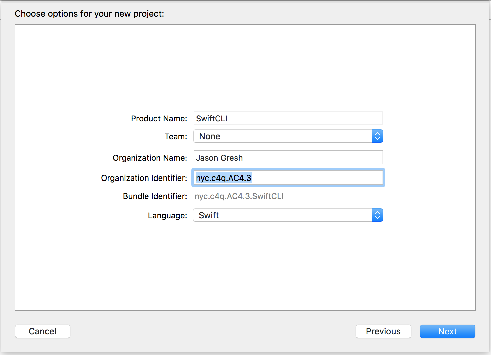
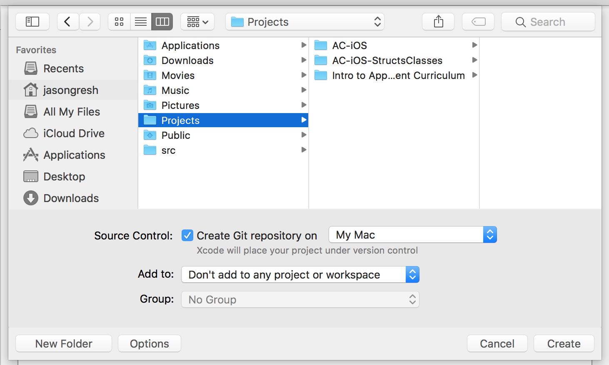
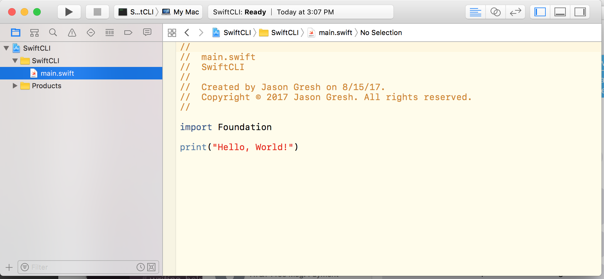

### Objective

* Build a command line Mac app for interactive programming
* Understand what an operating system is
* Understand where a program one writes lives within the operating system
* Understand how to get data in and out of that program

### Reading
- [Operating System](https://en.wikipedia.org/wiki/Operating_system)
- [Shell](https://en.wikipedia.org/wiki/Shell_(computing))
- [readLine](https://developer.apple.com/documentation/swift/1641199-readline)
- [print](https://developer.apple.com/documentation/swift/1541053-print)

---

### 1. Operating Systems

What is an Operating System?


Computer systems are highly layered in order to provide the minimum needed at each layer. This makes things more simple, stable and secure for developers and users. The user usually interacts with the operating system via either an application or a shell.

As programmers, much of the time we're thinking only about our code and how it runs, and not the environment it runs in. This will get us so far, but some input from the user is needed to start our program and perhaps interact further with it. Up until this point we've mostly hard coded values into our programs which is a limited way of interacting with the user. It requires him or her to be able to change the source code to try different inputs.

We need a way to get information into our program from the user. Enter the shell.

### 2. Shell

> In computing, a shell is a user interface for access to an operating system's services. In general, operating system shells use either a command-line interface (CLI) or graphical user interface (GUI), depending on a computer's role and particular operation. It is named a shell because it is a layer around the operating system kernel.
> [Wikipedia - Shell (computing)](https://en.wikipedia.org/wiki/Shell_(computing))


##### Graphical shells

Graphical shells are most familiar to modern computer users. A point and click interface is used to launch applications and manage files. This is the type of shell we'll be using for the majority of the course.

##### Command Line shells

Older, but not obsolete, are command line shells. Users launch applications and manage files by typing commands. This is the type of shell this lesson explores.


#### Input and Output

Think about apps you've run. Where do they get their input? Where does their output go?


### 3. Command Line Interface

At their simplest, command line interfaces get input from the keyboard and send output to a console. Console is another word for screen or terminal.

#### The pros and cons of the command line

**Pros**

* Learning to use and write command driven applications has many uses and deepens your toolkit and professional worth.
* Programs that run on the comand line can be connected with other command line programs ad hoc, making them become tools to be used inside larger scripts.
* There is a rich history of the command line and some tools either don't exist graphically or are more difficult to work with.
* Most Stack Overflow solutions to git and other problems will assume command line proficiency 
* Will help in interviews and interview exercises

**Cons**

* There's a learning curve to using command driven application


### 4. Build a Command Line Tool

1. Make a Projects directory in your home directory.
1. In XCode, go to File >> New >> Project.
1. Choose MacOS in the top tab bar.
1. Choose Command Line Tool in the Application section.
1. In the next dialog enter `SwiftCLI` for the Product Name, and `nyc.c4q.AC4.3` as the Organization Identifier.

	

1. Save the project into your Projects directory.
	
	

1. Open the main.swift file and insert code under the `import Foundation` line.

	

1. Run the program with the Play button in the upper left and notice the prompt in the debug console.

	

1. Interact with your program. This will behave differently based on your input.

	

1. By replacing the code inside `main.swift` you can reuse this project to try different code. This wouldn't be a good strategy for code you wanted to keep but is fine for now.

### 5. Two Sample Apps 

#### Echo clone

```swift
import Foundation

print("Type something, please: ", terminator: "")
if let response = readLine(strippingNewline: true) {
    print("You wrote this: \(response)")
}
else {
    print("You gotta enter something")
}

```

#### Days from now

```swift
import Foundation

print("How many days in the future: ", terminator: "")
if let response = readLine(strippingNewline: true),
    let days = Double(response) {
    let aDate = Date()
    let futureDate = aDate.addingTimeInterval(24 * 60 * 60 * days)
    print("\(days) days in the future will fall on the date \(futureDate)")
}
else {
    print("Something went wrong with what you entered. Should be a number.")
}
```