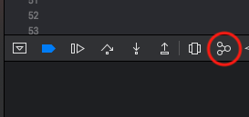
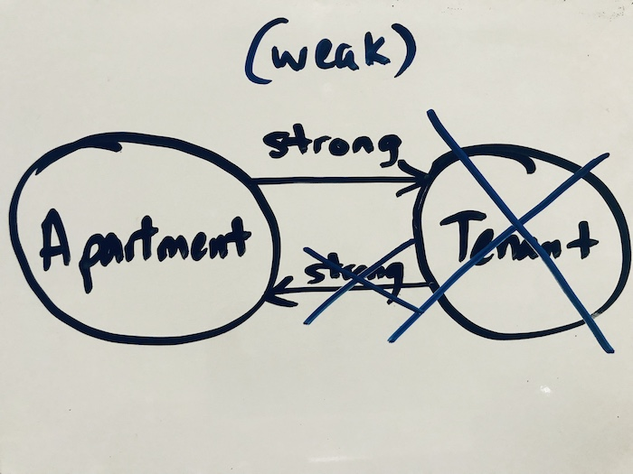

# Memory Management / Retain Cycles

## References

1. [ARC - Apple Docs](https://docs.swift.org/swift-book/LanguageGuide/AutomaticReferenceCounting.html)
2. [Krakendev - Reference types](https://krakendev.io/blog/weak-and-unowned-references-in-swift)
3. [Capture Lists - Bob the Developer](https://www.bobthedeveloper.io/blog/swift-capture-list-in-closures)

## Objectives

1. Explain what ARC is and why its used
2. Explain strong, weak and unowned reference types
3. Understand what a retain cycle is and explain how to avoid them
4. Write code that prevents retain cycles from occurring


# 1. What is ARC?

ARC stands for Automatic Reference Counting.  It's the process by which iOS cleans up objects that no longer need to be held in memory.  Once an object no longer has anything that references it, it can be taken out of memory.

```swift
class Person {
    var name: String
    init(name: String) {
        self.name = name  
    }
}

var testPerson: Person? = nil
testPerson = Person(name: "Abe")
```

This creates the following picture:

```
(testPerson) --->  New Person Object: "Abe"
```

If we set testPerson to nil again, there is no reason to hold the Person object in memory anymore.  No one is referring to it, so it isn't possible for anyone to care about its properties.  Swift (or Objective-C) can then safely deinitialize the Person object.  We can see this happening directly by adding a special method called *deinit*.  Just like *init* is called when we create an object, *deinit* is called when the object is deallocated from memory.


```swift
class Person {
    var name: String
    init(name: String) {
        self.name = name
        print("Initialized person \(self.name)")
    }
    deinit {
        print("Deinitializing person \(self.name)")
    }
}


var myPerson: Person?
myPerson = Person(name: "Abe")
myPerson = nil
```

Abe will also be deinitialized if we reassign myPerson to someone else:

```
var myPerson: Person?
myPerson = Person(name: "Abe")
myPerson = Person(name: "Bart")
```

But if we keep a reference, to Abe somewhere else, then it won't be deinitialized when myPerson is set to nil:

```
var myPerson: Person?
myPerson = Person(name: "Abe")
let alsoAbe = myPerson
myPerson = nil
```

ARC only deallocates an object when it knows that no one else is referring to it.

# 2. Swift Reference Types

There are 3 ways to declare a reference in Swift.  We need multiple reference types to help avoid *retain cycles* which we'll see about in the next section.

```swift
var favoritePerson = Person(name: "Otis Redenbacher") //Strong reference
weak var weakFavorite = favoritePerson  //Weak reference
unowned var unownedFavorite = favoritePerson //Unowned reference
```

### Strong references

Strong references are the default.  They work exactly like in the examples above.  ARC counts the strong references to an object, and deallocates it once that count is zero.

### Weak references

Weak references are a way of making a reference to an object, without it counting towards ARC.  weakFavorite is of the type Person?.  If we reassign favoritePerson to a new Person object, ARC will see that there are no longer any strong references to the Person "Otis Redenbacher".  It will then deallocate the object.  So what will weakFavorite do when we ask it what it's assigned to?

```swift
favoritePerson = Person(name: "James Watkins")
print(weakFavorite)
```

weakFavorite didn't count as a reference to ARC because it wasn't a strong reference.  When the object it was weakly referencing is deallocated, `weakFavorte` gets set to nil.

### Unowned references

Unowned references are another way of making a reference that doesn't count towards ARC.  Unlike weak variables, unowned variables are not optionals.  If you try to use an unowned variable after the object it was referring to has been deallocated, your app will crash.  Think of it like the force unwrapping of references.  

```swift
print(unownedFavorite) //Will crash if the object unownedFavorite referenced has been deallocated.
```

# 3. Retain cycles

Why does Swift have multiple different types of references we can make?  We've seen how they interact with objects being deallocated, but why does this matter?  We will use these different reference types to avoid *retain cycles*

What is a retain cycle?  A retain cycle occurs when two objects have strong references to each other.

```swift
class Apartment {
    let name: String
    var tenant: Person?
    init(name: String) {
        self.name = name
        print("Initialized apartment \(self.name)")
    }
    deinit {
        print("Deinitializing person \(self.name)")
    }
}

class Person {
    let name: String
    var apartment: Apartment?
    init(name: String) {
        self.name = name
        print("Initialized person \(self.name)")
    }
    deinit {
        print("Deinitializing person \(self.name)")
    }
}


var john: Person?
var unit4A: Apartment?

john = Person(name: "John Appleseed")
unit4A = Apartment(name: "Unit 4A")

john!.apartment = unit4A
unit4A!.tenant = john

john = nil
unit4A = nil
```


Because both objects have a strong reference to each other, they will stay in memory and not be deallocated.  There is no way for them to leave memory because we no longer have references to them, but they stay in memory because they have strong reference to each other.  How can we resolve this?

```swift
class Apartment {
    let name: String
    weak var tenant: Person?
    init(name: String) {
        self.name = name
        print("Initialized apartment \(self.name)")
    }
    deinit {
        print("Deinitializing person \(self.name)")
    }
}
```

By making the tenant a weak var, it will not hold a strong reference.  Instead, it will hold a weak reference.  This means it does not count towards the Person object's retain count.


When we set john to nil, we remove all strong references to the Person instance.  The Apartment object holds only a weak reference to the Person, so it doesn't count towards ARC.  The tenant of unit4A is now nil.

```swift
unit4A.tenant == nil
//true
```

When we set unit4A to nil, all strong references to the Apartment instance are removed, because the Person instance has already been deallocated.  By making weak references, we are able to get around creating these retain cycles.


# 4. Visualizing Retain Cycles

```swift
import UIKit

class Tenant {
  var name: String
  var apartment: Apartment?
  init(name: String) {
    self.name = name
    print("\(name) is being initialized")
  }
  deinit {
    print("\(name) is being deinitialized")
  }
}

class Apartment {
  var unit: String
  var tenant: Tenant?
  init(unit: String) {
    self.unit = unit
    print("\(unit) is being initialized")
  }
  deinit {
    print("\(unit) is being deinitialized")
  }
}

class ViewController: UIViewController {
  override func viewDidLoad() {
    super.viewDidLoad()

    var apartment: Apartment? = Apartment(unit: "Apt 6B")
    var alex: Tenant? = Tenant(name: "Alex")

    apartment?.tenant = alex
    alex?.apartment = apartment

    alex = nil

    apartment = nil
  }
}
```

## Using the Debug Memory Graph

To investigate memory issues in your app you can use the **Memory Graph Debugger** It can be found next to the **Visual Debugger** button in Xcode.




Visual Debugger shows a strong reference cycle between Apartment and Tenant classes.


**Let's resolve this memory cycle.**





We will mark one of the classes **weak** to break the reference cycle
```swift
weak var apartment: Apartment?
```

## Resolving Strong Reference Cycles for Closures

> Swift requires you to write self.someProperty or self.someMethod() (rather than just someProperty or someMethod()) whenever > you refer to a member of self within a closure. This helps you remember that it’s possible to capture self by accident.

Use a capture list to break the strong reference cycle with closures.

1. If you know the object e.g self will be on the heap after the closure is done you can use
```swift
[unowned self]
```
NB: If you use unowned and the object is no longer on the heap the app will crash, by default use weak unless you are absolutely sure self will be around.

2. If there is a possibility that the object calling the closure will leave the heap making it nil then use
```swift
[weak self]
```
