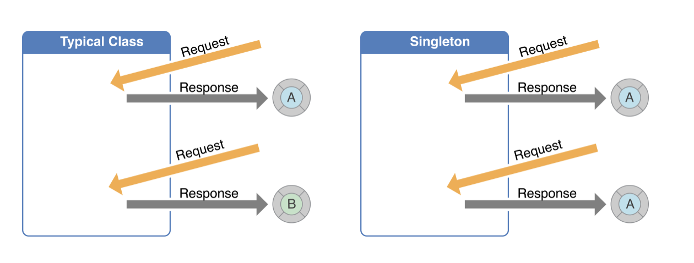

## Singleton
A singleton class returns the same instance no matter how many times an application requests it. A typical class permits callers to create as many instances of the class as they want, whereas with a singleton class, there can be only one instance of the class per process. A singleton object provides a global point of access to the resources of its class. Singletons are used in situations where this single point of control is desirable, such as with classes that offer some general service or resource.




## Creating a singleton

```swift
//create your class
class MyClass {
//mark the initializer as private
 private init() {}
//create a type property to access the only instance
static let shared = MyClass()

//write your methods below

}
```

## Accessing a singleton

```swift
myClass.shared.yourMethod
```


[Example Project](https://github.com/lynksdomain/SingletonExample)
