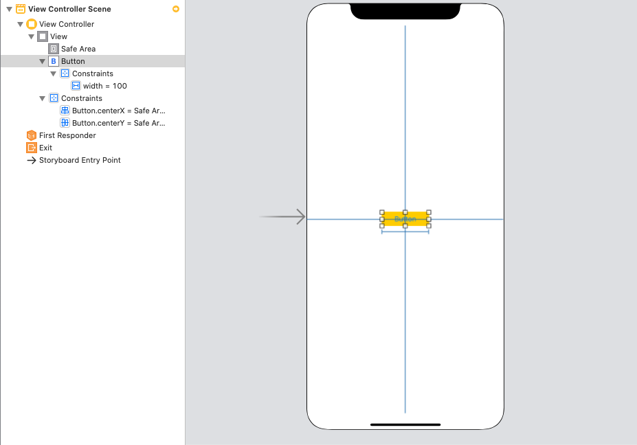
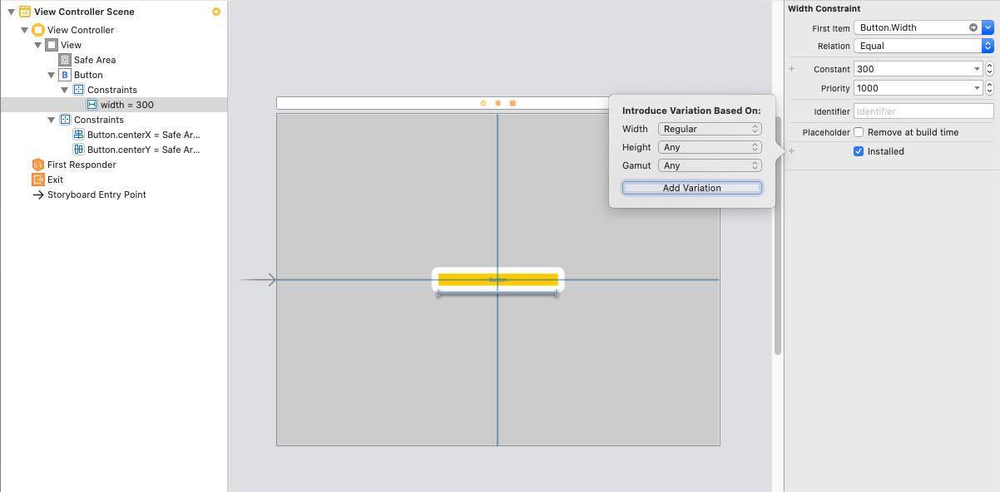
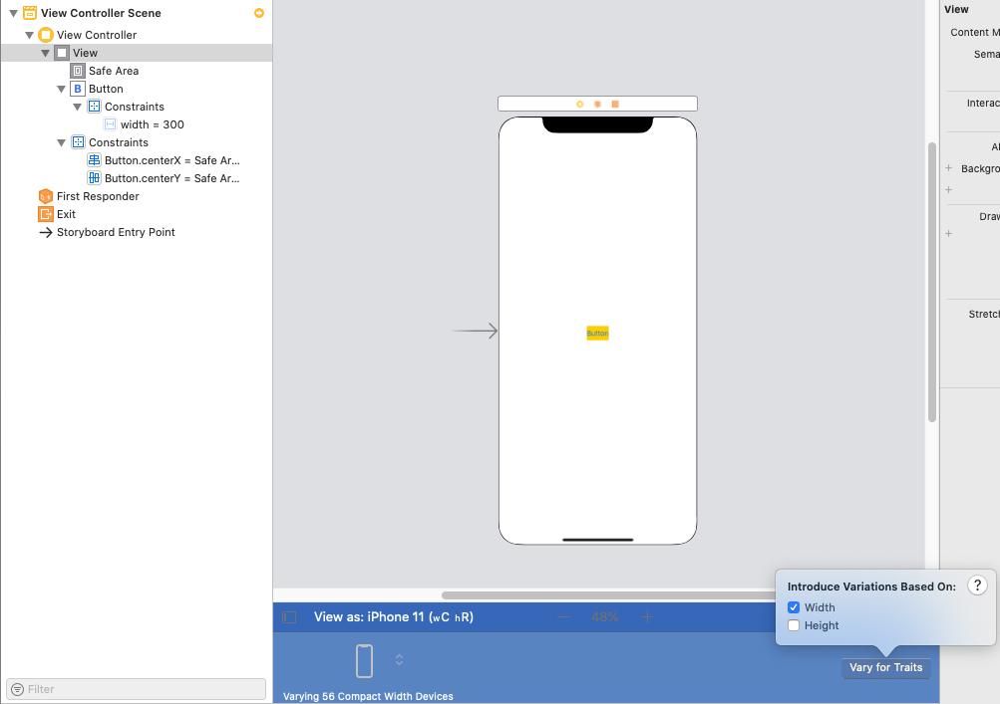
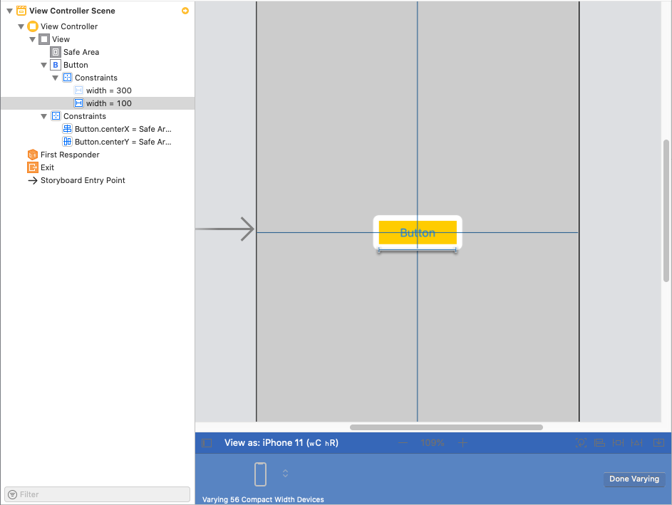

# Advanced Auto Layout

## Objectives

- Understand what problem Auto Layout solves 
- Explain what translatesAutoresizingMaskIntoConstraints does
- Use size classes to built custom UI
- Understand the VFL is used to debug runtime Auto Layout issues

## Resources

- [The Algebra of UI Layout Constraints](http://croisant.net/blog/2016-02-24-ui-layout-constraints-part-1/)
- [AutoResizingMask](http://www.thecodedself.com/autoresizing-masks/)
- [Size Classes](https://uxplanet.org/what-should-designers-know-about-universal-app-8f6a544ea588)

# 1. Auto Layout Introduction

We've been using Auto Layout to build the UI for all of the apps we've created so far.  But what is it?  Auto Layout is an algorithm that takes in objects and constraints as input, and outputs the appropriate positions for each object.  The algorithm that does this uses the [Simplex Algorithm](http://fourier.eng.hmc.edu/e176/lectures/NM/node32.html) to identify the constraints.  There's a lot of very high level math in the link above, but the basic idea goes like [this](http://croisant.net/blog/2016-02-24-ui-layout-constraints-part-1/):

Imagine we have a view like below:


And the following constraints:

1. Both elements should be as wide as possible, but it is most important for B to be as wide as possible.
1. B must be at least 50 pixels wide.
1. T must be at least twice as wide as B.
1. Both elements side by side must fit in a 300 pixel wide area.

We can rewrite these mathematically:

1. Maximize 10b + t, subject to:
1. b ≥ 50
1. t ≥ 2b
1. b + t ≤ 300

For point (1), we state that we want to maximize the combined width (b+t).  We give `b` a coefficient of 10, because it's more important to maximize `b`.

We can then graph each of the inequalities:


The yellow area represents all values of `b` and `t` that satisfy the inequalities.  Our task is then to *maximize* the width.  We can see here rightmost corner is the highest possible value.

It's easy to visualize with only three constraints, but if we had dozens or hundreds of constraints, we'd be unable to see what the solution was from graphing it.  The Simplex Algorithm does this work for us, and is what Auto Layout is based on.

# 2. translatesAutoresizingMaskIntoConstraints

In the days before Auto Layout, iOS applications used a concept called an AutoResizingMask.  You've seen this before in the line:

```swift
myView.translatesAutoresizingMaskIntoConstraints = false
```

And in errors like:

```
2020-01-13 14:42:11.882184-0500 AutoLayoutIntDepth[11495:652214] [LayoutConstraints] Unable to simultaneously satisfy constraints.
	Probably at least one of the constraints in the following list is one you don't want.
	Try this:
		(1) look at each constraint and try to figure out which you don't expect;
		(2) find the code that added the unwanted constraint or constraints and fix it.
	(Note: If you're seeing NSAutoresizingMaskLayoutConstraints that you don't understand, refer to the documentation for the UIView property translatesAutoresizingMaskIntoConstraints)
(
    "<NSAutoresizingMaskLayoutConstraint:0x600001988b40 h=--& v=--& UITableView:0x7ff5b6819200.minY == 0   (active, names: '|':UIView:0x7ff5b5702ad0 )>",
    "<NSLayoutConstraint:0x600001981a40 UITableView:0x7ff5b6819200.top == UILayoutGuide:0x6000003a4380'UIViewSafeAreaLayoutGuide'.top   (active)>",
    "<NSLayoutConstraint:0x60000198b020 'UIViewSafeAreaLayoutGuide-top' V:|-(44)-[UILayoutGuide:0x6000003a4380'UIViewSafeAreaLayoutGuide']   (active, names: '|':UIView:0x7ff5b5702ad0 )>"
)
```

So what is it anyways and why does iOS default to it?

In the time before Auto Layout, iOS development used autoresizing masks, which use a simpler method to dictate how views should shrink and grow.  For every view, you can specify which aspects are flexible with the following properties:

- `UIViewAutoresizingNone`
- `UIViewAutoresizingFlexibleLeftMargin`
- `UIViewAutoresizingFlexibleWidth`
- `UIViewAutoresizingFlexibleRightMargin`
- `UIViewAutoresizingFlexibleTopMargin`
- `UIViewAutoresizingFlexibleHeight`
- `UIViewAutoresizingFlexibleBottomMargin`

Depending on the value of these properties, the view will grow and shrink differently as the view expands or contracts.  This is called a **struts** and **springs** system, where the struts are the distance to its container, and the springs are the height and width.

You can see the effect these have in Storyboard, by selecting the Size Inspector for any view:


With the introduction of Auto Layout, Apple added a bridge where you could take an old application using autoresizing masks, and convert them to new constraints.  This is the `translatesAutoresizingMaskIntoConstraints` property.  You should almost always set this to false and use Auto Layout, but there are [occasional use cases](http://www.thomashanning.com/xcode-8-mixing-auto-autoresizing-masks/) for autoresizing masks.

# 3. Content Hugging and Compression Resistance

In the example given with the button above, we used a simple constraint:

1. Both elements should be as wide as possible, but it is most important for B to be as wide as possible.

Using Auto Layout, we can specify which view should grow or shrink if there are multiple possibilities.  The key terms for this are *content hugging* and *compression resistance*

From [stackoverflow](https://stackoverflow.com/questions/15850417/cocoa-autolayout-content-hugging-vs-content-compression-resistance-priority):


- Hugging => content does not want to grow
- Compression Resistance => content does not want to shrink

Example:

Say you've got a button like this:

```
[       Click Me      ]
```

and you've pinned the edges to a larger superview with priority 500.

Then, if Hugging priority > 500 it'll look like this:

```
[Click Me]
```

If Hugging priority < 500 it'll look like this:

```
[       Click Me      ]
```

If the superview now shrinks then, if the Compression Resistance priority > 500, it'll look like this

```
[Click Me]
```

Else if Compression Resistance priority < 500, it could look like this:

```
[Cli..]
```

# 4. Size Classes

When designing apps, it is important to ensure that the UI works on all supported devices.  It's easy to make an app that works on both the iPhone 7, and iPhone 8, but can require more intentionality to ensure that the layout works just as well on the new iPad Pro.  Recognizing this, Apple allows you to create special constraints that only work for devices of a particular **size class**.

All devices have a height and width.  Apple divides each those into two categories: *regular* and *compact*.  An iPhone X has a compact width and regular height.  An iPad has a regular width and regular height:


We can use size classes to build our UI differently for different kinds of devices.

Create a button and pin it to the center of a View Controller.  Change its background color to yellow so you can see its entire frame.  Then, constrain its width to 100.  



When we look at our app using a rotated iPad, we might decide that we want the button to be wider.  Let's change the constant to 300.  Then click on the "+" button, and select `Regular` for width and `Any` for height in the menu titled "Introduce Variation Based On".



Then, uncheck the "installed" checkbox that doesn't have the size class next to it:


This constraint will then only apply to regular width devices.  We can now add a constraint for compact width devices.  We can use another tool Xcode gives us: the "Vary for Traits" button.  

Select an iPhone again in portrait mode, then click the "Vary for Traits" button at the bottom of the screen:



Add a width constraint of 100, then click "Done Varying"



Now, build and run your app.  In iPhone portrait orientation, the button has a width of 100.  In landscape it has a width of 300.  This is a powerful tool that can allow you to dramatically alter the layout of you application based on what devices are loaded.

# 5. Visual Format Language

When you get errors at runtime using Auto Layout, the format comes in an odd syntax:

```
<NSAutoresizingMaskLayoutConstraint:0x600001988b40 h=--& v=--& UITableView:0x7ff5b6819200.minY == 0   (active, names: '|':UIView:0x7ff5b5702ad0 )>
```

This is called [Visual Format Language](https://developer.apple.com/library/archive/documentation/UserExperience/Conceptual/AutolayoutPG/VisualFormatLanguage.html).  It is possible to write constraints programmatically using VFL.  From [Ray Wenderlich](https://www.raywenderlich.com/277-auto-layout-visual-format-language-tutorial):

```swift
// 1
let views: [String: Any] = [
  "iconImageView": iconImageView,
  "appNameLabel": appNameLabel,
  "skipButton": skipButton]

// 2
var allConstraints: [NSLayoutConstraint] = []

// 3
let iconVerticalConstraints = NSLayoutConstraint.constraints(
  withVisualFormat: "V:|-20-[iconImageView(30)]",
  metrics: nil,
  views: views)
allConstraints += iconVerticalConstraints

// 4
let nameLabelVerticalConstraints = NSLayoutConstraint.constraints(
  withVisualFormat: "V:|-23-[appNameLabel]",
  metrics: nil,
  views: views)
allConstraints += nameLabelVerticalConstraints

// 5
let skipButtonVerticalConstraints = NSLayoutConstraint.constraints(
  withVisualFormat: "V:|-20-[skipButton]",
  metrics: nil,
  views: views)
allConstraints += skipButtonVerticalConstraints

// 6
let topRowHorizontalConstraints = NSLayoutConstraint.constraints(
  withVisualFormat: "H:|-15-[iconImageView(30)]-[appNameLabel]-[skipButton]-15-|",
  metrics: nil,
  views: views)
allConstraints += topRowHorizontalConstraints

// 7
NSLayoutConstraint.activate(allConstraints)
```

You may see this in the wild, but it is not used by most developers.
